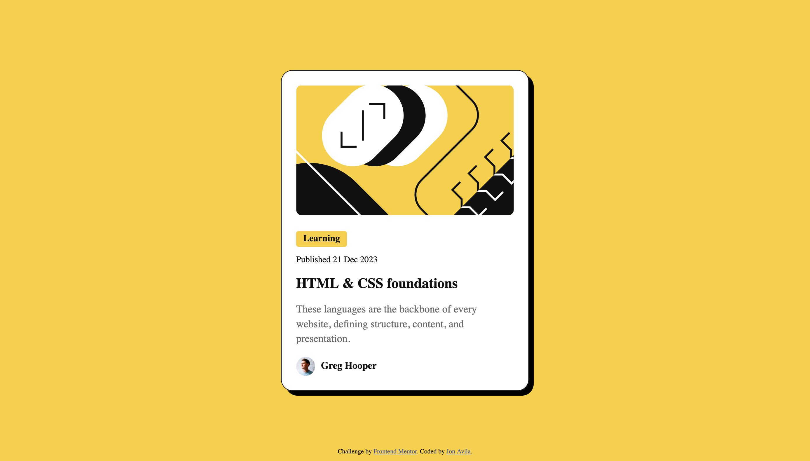

# Frontend Mentor - Blog preview card solution

This is a solution to the [Blog preview card challenge on Frontend Mentor](https://www.frontendmentor.io/challenges/blog-preview-card-ckPaj01IcS). Frontend Mentor challenges help you improve your coding skills by building realistic projects.

## Table of contents

- [Overview](#overview)
  - [The challenge](#the-challenge)
  - [Screenshot](#screenshot)
  - [Links](#links)
- [My process](#my-process)
  - [Built with](#built-with)
  - [What I learned](#what-i-learned)
  - [Continued development](#continued-development)
- [Author](#author)

## Overview

### The challenge

Users should be able to:

- See hover and focus states for all interactive elements on the page

### Screenshot

### Links

- Live Site URL: [https://madroosterlab.github.io/FEM-BlogCard](https://madroosterlab.github.io/FEM-BlogCard)

## My process

Code, pray, test, repeat...

### Built with

- CSS custom properties
- Flexbox

### What I learned

I'm scraping off some rust from my HTML & CSS skills. This challenge was easy but took me a lot of time. I hope to continue to build up my skills from here. This is the first page I've coded in several years. Yikes!

### Continued development

I would love to make this page completely responsive. I need to study and review a lot of notes before I can attempt that. I would also like to use semantic HTML, less ID's, and no negative margins. I only did that once!

## Author

- Frontend Mentor - [@madroosterlab](https://www.frontendmentor.io/profile/madroosterlab)
- X - [@madroosterlab](https://x.com/madroosterlab)
